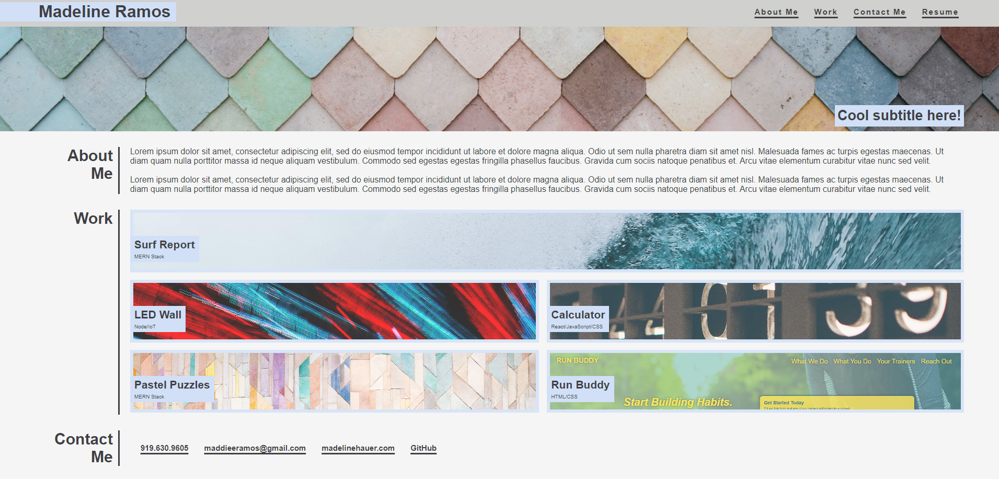

# Madeline_Ramos_Portfolio

## Project Description:

---

This application is the base outline of a portfolio website. It has all the main components that a potential employer is looking for including a personal bio, contact resources, and live url links to completed work. At the moment the "work" section of the page is all linked to Google (minus the Run Buddy application) this is due to the projects not being done/completed. There will be many future edits to add in live running examples of work.

 

## Languages Used:

---

- HTML (Hypertext Markup Language)
- CSS (Cascading Style Sheets)

 

## Links:

---

https://madelineramos.github.io/Madeline_Ramos_Portfolio/

 

## Webpage Screenshot:

---

